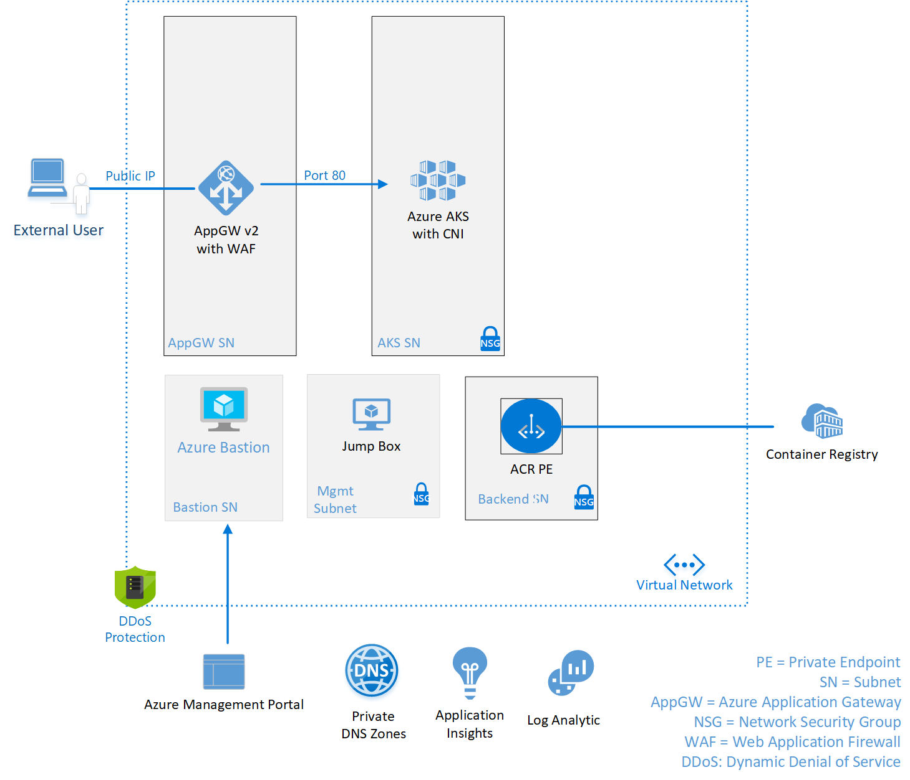
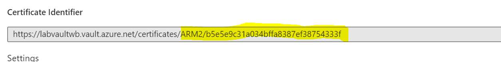
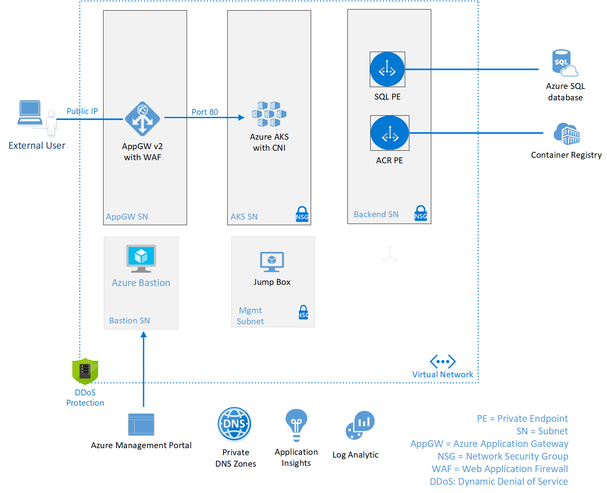
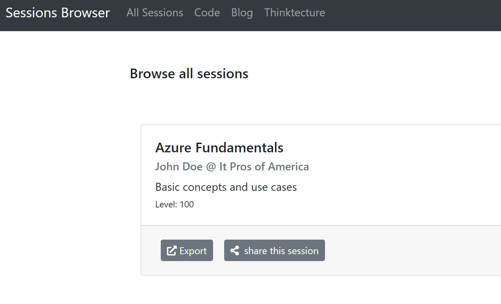
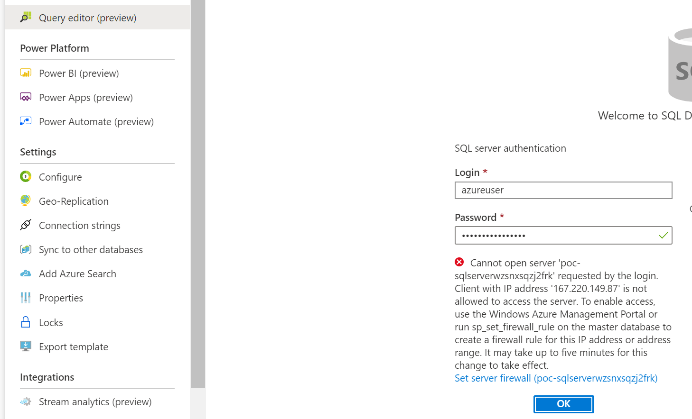
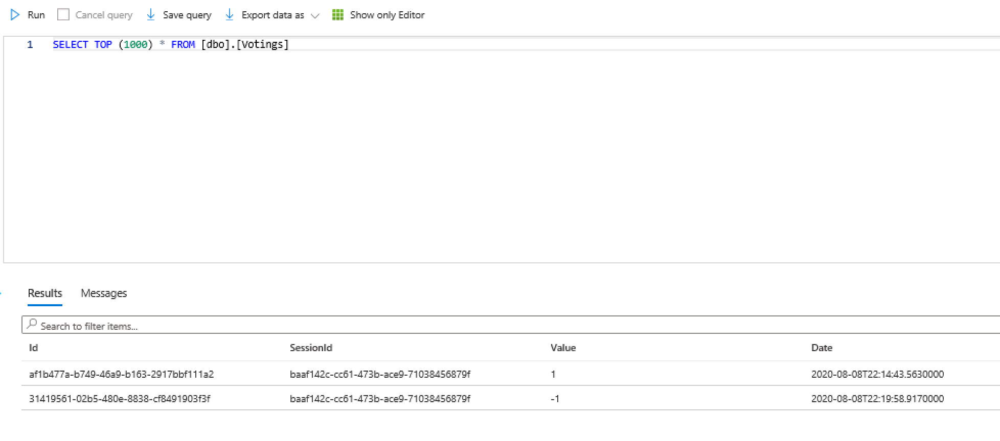

# Example Deployments  

This repo has several examples of deploying an AKS Cluster. All of these deployments use nested deployments that are located in the [CSA Nested Template Repo](https://github.com/microsoft/CSANestedTemplates)  

## Table of Content  

* [AKS Applications](#AKSApplications)
     - [HTTP AppGW with AKS](#HTTPAppGWAKS)
     - [HTTPS AppGW with AKS](#HTTPSAppGWAKS)  
     - [HTTP AppGW with AKS and Azure SQL DB Backend](#HTTPAppGWAKSSQL)
     - [HTTPS AppGW with AKS and Azure SQL DB Backend](#HTTPSAppGWAKSSQL)

# AKS Applications  
Below we'll walk through some depoloyments that involve an AKS Application being deployed in Azure

## Simple Web Application deployed in AKS and exposed thorugh Application Gateway with an HTTP Listener  
This architecture is made of of the following resources:  
- Virtual Network with the following Subnets  
    - AppGW-SN  
    - AKS-SN  
    - Data-SN  
    - Bastion-SN  
    - Management-SN  
- Application Gateway v2 with WAF and Public IP  
- AKS Cluster
- Azure Container Registry with Private Endpoint  
- Azure Bastion  
- Virtual Machine  
- Azure Private DNS Zones for Private Endpoints  
- Log Analytics Workspace for Monitoring  
- Application Insights Instance for APIM and API  

  

This is an example of a simple web application being deployed in AKS. The deployment does not expose AKS directly but requires external users to go throuh the Application Gateway to access the website. We will secure the traffic between the subnets using Network Security Groups with the added protection of the WAF being utilized by the Application Gateway. ACR will Private Endpoints and not allow access to their public endpoints.  

### Deploy to Azure  

#### Pre-Req  
Use the below link to deploy this solution to Azure.   

You will need to provide the following Parameters when deploying:  

| Name       | Description     | Example     |
| :------------- | :----------: | -----------: |
|  deploymentPrefix | Prefix value for naming resources   | POC    |
| adminUserName   | Username for both the Jump VM and SQL DB | azureUser |  
| adminPassword   | Password for both the Jump VM and SQL DB | 1qaz@WSX3edc$RFV |    

### Demo Script  
Starting out the demo we want to imphasize that we are starting with nothing deployed. You can go into the portal and show that the resource group doesn't exists. Once you've shown that the resource group is empty go ahead and kick off the deployment. This will take a ~20 minutes to deploy so you want to start this off asap.  

#### What to talk about while this is deploying  
##### Overview
1) Show the GitHub repo and the documentation. Documentation of the templates and deployments is important and often glossed over. Spend some time showing how we are documenting the overall deployment as long as all the nested deployments.  
2) Show that everything we have in the HTTP-AppGW-AKS template are nested templates and we don't deploy any resource directly except for the Resource Group itself.  
3) Show how the nested templates are called from within the main template. Spend a little bit of time showing the variables that point to the GitHub repo  

##### Detailed  
1) Show either the AppGWHTTPListener template or the VNet template. I'd probably show the VNet template because it's simpler and then emphasize we used a simular approach for the GW deployment. We want to demo this because we make these deployments very dynamic by passing in array values. For example, on the VNet template I'd show the parameter values being passed in for the subnets in this template:  

      "subnets": {
        "type": "array",
        "defaultValue": [
          "APIM-SN|192.168.1.224/28|Enabled",
          "AKS-SN|192.168.1.0/25|Enabled",
          "Data-SN|192.168.1.176/28|Disabled",
          "Shared-SN|192.168.1.160/28|Enabled",
          "AzureBastionSubnet|192.168.1.128/28|Enabled",
          "AppGW-SN|192.168.1.144/28|Enabled"
        ]
      }

Then go over to the actual VNet template and show how we're parsing this using a loop in the variable section:  

    "copy": [
      {
        "name": "subnets",
        "count": "[length(parameters('subnets'))]",
        "input": {
          "name": "[split(parameters('subnets')[copyIndex('subnets')],'|')[0]]",
          "properties": {
             "addressPrefix": "[split(parameters('subnets')[copyIndex('subnets')],'|')[1]]",
             "privateEndpointNetworkPolicies": "[split(parameters('subnets')[copyIndex('subnets')],'|')[2]]"
          }
        }
      }
    ]  

And finally how we're using that variable in the resource deployment itself:  

       "subnets": "[variables('subnets')]"  

2) You can go over the DSC Script itself. Open the script located in /dsc/AKSSQLConfig.ps1  
-- Talk about the parameter section and how values are passed in  
-- Talk about the section where we are installing the tools and initializing a reboot  
-- Show how you login to azure with the managed identity using az login --identity  
-- Walk through some of the things that are customized through the script  
    -- YAML File  
    -- Uploading image to ACR  
    -- etc..  

#### Demo Solution  
Once the template is deployed you can show off the finished product.  

1) The first thing I would show is accessing the website. 
    -- Open up your Application Gateway and get the Public IP for the GW.  
    -- In a web browser go to https://<PublicIP> (because it's a self signed cert you'll need to ignore the warning)  
    -- This is a very simple website so there isn't too much to show besides the website is up and running    
2) Show access to the website using the LB IP directly in the Jump Box. Login to the VM using Azure Bastion which was deployed through the template. The default username and password is azureuser and 1qaz@WSX3edc$RFV. Once in the VM off the enhanced IE security and then go to http://<lbIP>. By default this is 192.168.1.126   

3) You can also show some of the resources deployed through the template that are sitting in the newly created Resource Group  

### Deployment Details  
Below are the details on the ARM Template used to deploy this solution. 

#### Virtual Network Architecture  
Below we will outline the Virtual Networks and NSGs associated with them.  

##### Application Gateway Subnet  
We protect this subnet utilizing both a NSG and the WAF associated with the Application Gateway. The NSG will only allow traffic on port 443 for end user access and the ports needed for the Application Gateway health status. Below outlines the NSG that is created in the template.  

| Name          | Priority | Description   |  Direction     | Source/Destination Port     | Source/Destination Address  | Protocol  | 
|-------------------|-------------------|-------------------|-------------------|-------------------|-------------------|-------------------|
| Allow-443-GW          | 100 | Allow 443 Traffic Inbound from GW Subnet | Inbound  | \*\/443 | \<GW Subnet\>/\*   | TCP |
| Allow-443-Mgmt          | 110 | Allow 443 Traffic Inbound from Mgmt Subnet | Inbound  | \*\/443 | \<Mgmt Subnet\>/\*   | TCP |
| Allow-HealthProbe     | 110 | Allow the AppGW Health Status | Inbound  | \*\/65200-65535 | Azure/\* | TCP |
| Deny-All-Inbound		   | 500 | Deny All Traffic | Inbound | \*/\*   | \*/\* | TCP |  

##### AKS Subnet  
This subnet will have an empty NSG attached to it. We will utilize ingress and egress controllers within AKS to control traffic.  

##### Data Subnet  
The data subnet in this template only contains the virtual nics for the private endpoints. In the furture we may add aditon data points for the application so we will go ahead and restrict this and deny all traffic. If other data points are added we would allow that traffic at that point. Note that even through the virtual nic sits on this VNET the NSGs do not take affect for the traffic to it.   

| Name          | Priority | Description   |  Direction     | Source/Destination Port     | Source/Destination Address  | Protocol  | 
|-------------------|-------------------|-------------------|-------------------|-------------------|-------------------|-------------------|
| deny-all-ib		   | 500 | Deny all inbound traffic | Inbound | \*/\*   | \*/\* | TCP |  
| deny-all-ob		   | 500 | Deny all outbound traffic | Outbound | \*/\*   | \*/\* | TCP |  
  

##### Management Subnet  
The management subnet contains a virtual machine with only a private IP address. This is a management jump box that will be accessed externally through Azure Bastion. So we will allow the Azure Bastion subnet access.  

| Name          | Priority | Description   |  Direction     | Source/Destination Port     | Source/Destination Address  | Protocol  | 
|-------------------|-------------------|-------------------|-------------------|-------------------|-------------------|-------------------|
| Allow-Bastion		   | 100 | Allow Bastion subnet | Inbound | \*/\*   | \<Bastion Subnet\>/\* | TCP |  
| deny-all-ib		   | 500 | Deny all inbound traffic | Inbound | \*/\*   | \*/\* | TCP |  

##### Virtual Network Deployment  
In order to deploy the Virtual Network we need to utilize 4 nested templates  
1) VNet  
2) GetSubnetAddressPrefix  
3) NSG-Empty-ExistingSubnet  
4) NSG-ExistingSubnet  

For every NSG you deploy you'll need to utilize GetSubnetAddressPrefix and then either NSG-Empty-ExistingSubnet or NSG-ExistingSubnet. 

First we deploy the Virtual Network with the subnets defines. The following Parameters are used for the VNet deployment:  

      "addressRange": {
        "type": "String",
        "defaultValue":"192.168.1.0/24",
        "metadata": {
          "description": "Administrator password for the local admin account"
        }
      },
      "subnets": {
        "type": "array",
        "defaultValue": [
          "aks-SN|192.168.1.0/25|Enabled",
          "data-SN|192.168.1.176/28|Disabled",
          "shared-SN|192.168.1.160/28|Enabled",
          "AzureBastionSubnet|192.168.1.128/28|Enabled",
          "AppGW-SN|192.168.1.144/28|Enabled"
        ]
      }

The following variable is used to define the VNet name: 

      "vnetName": "[concat(parameters('deploymentPrefix'),'vnet',uniqueString(parameters('resourceGroup')))]"

The following is used to deploy the VNet:  

            "vNETName": {
              "value": "[variables('vnetName')]"
            },
            "addressRange": {
              "value": "[parameters('addressRange')]"
            },
            "subnets": {
              "value": "[parameters('subnets')]"
            }

Now that we have a virtual network and subnets we need to create and attach NSGs to them. Below I'll walk through the AKS NSG deployment. To get the AKS Address range we call "GetSubnetAddressPrefix" using the following:

            "vnetName": {
              "value": "[variables('vnetName')]"
            },
            "subnetName": {
              "value": "AKS-SN"
            }

Now that we have the address prefix for the AKS subnet we can call "NSG-Empty-ExistingSubnet" using the following:  

            "virtualNetworkName": {
              "value": "[variables('vnetName')]"
            },
            "subnetName": {
              "value": "AKS-SN"
            },
            "addressPrefix": {
              "value": "[reference('getAKSAddressPrefix').outputs.addressPrefix.value]"
            },
            "nsgName": {
              "value": "AKS-NSG"
            }

#### Application Gateway Deployment  
Application Gateway WAF v2 is deployed for this architecture. We deploy with both a Public and Private endpoint for the gateway and inject it onto the Application Gateway Subnet. 

In order to deploye the Application Gateway we need to first create a Public IP Address. We call the Nested Template "PublicIPAddress" using the following values.  

            "publicIpAddressName": {
              "value": "[concat(variables('applicationGatewayName'),'pip1')]"
            },
            "sku": {
                "value": "Standard"
            },
            "allocationMethod": {
                "value": "Static"
            }  

Now we are able to deploy the Application Gateway. Below are the Parameters in the 3-Tier-APIM-AKS-SQL.json related to the Application Gateway.  
      "deploymentPrefix": {
          "type": "string",
          "defaultValue": "poc"
      },
      "appgwtier": {
        "type": "string",
        "defaultValue": "WAF_v2"
      },
      "appgwskuSize": {
          "type": "string",
          "defaultValue": "WAF_v2"
      },
      "appgwzones": {
          "type": "array",
          "defaultValue": [
                  "1",
                  "2",
                  "3"
          ]
      },
      "appgwMinCapacity": {
          "type": "int",
          "defaultValue": 1
      },
      "appgwMaxCapacity": {
          "type": "int",
          "defaultValue": 3
      }  

We set the name of the application gateway utilizing the below variable in the template.  

      "applicationGatewayName": "[concat(parameters('deploymentPrefix'),'appgw',uniqueString(parameters('resourceGroup')))]"  

Now we are ready to execute the creation of the Application Gateway using the following:  

            "applicationGatewayName": {
                "value": "[variables('applicationGatewayName')]"
            },
            "tier": {
                "value": "[parameters('appgwtier')]"
            },
            "skuSize": {
                "value": "[parameters('appgwskuSize')]"
            },
            "minCapacity": {
                "value": "[parameters('appgwMinCapacity')]",
            },
            "maxCapacity": {
                "value": "[parameters('appgwMaxCapacity')]",
            },
            "zones": {
                "value": "[parameters('appgwzones')]"
            },
            "subnetID": {
                "value": "[concat(reference('deployVNET').outputs.vnetId.value,'/subnets/AppGW-SN')]"
            },
            "publicIpAddressesIds": {
                "value": [
                  "[concat('PIP1|',reference('deployPublicIP1').outputs.publicIPID.value )]"
                ]
            },
            "frontendPorts": {
                "value": [
                  "HTTP-80|80"
                ]
            },
            "backendAddresses": {
                "value": [
                  "[concat('APIMGW|', variables('apimName'),'.azure-api.net')]"
                ]
            },
            "backendHttpSettings": {
                "value": [
                  "APIM-HTTPSSetting|443|Https|Disabled|30|/"
                ]
            },
            "httpListeners": {
                "value": [
                  "APIMListener|PIP1|HTTP-80"
                ]
            },
            "requestRoutingRules": {
                "value": [
                  "Apim-RoutingRule|APIMListener|APIMGW|APIM-HTTPSSetting"
                ]
            }  

This will configure the application gateway to listen on port 443 using the certificate configured in Key Vault. It has a single backend pool that sends traffic on port 443 to the APIM GW address that will be created later.  

The last step for the application Gateway is to configure the diagnostic and metrics to be sent to a log analytics workspace. Before we do this we need to create the workspace using the Nested Template "Log_Analytics_Workspace" using the following:  

              "value": "[variables('laName')]"  

Note that the laName variable is set like this: "[concat(parameters('deploymentPrefix'),'la',uniqueString(parameters('resourceGroup')))]"  

Now that we have a Log Analytics Workspace we can use the Nested Template "AppGWDiagnostics" using the following:  

            "workspaceId": {
                "value": "[reference('deployLogAnalytics').outputs.workspaceId.value]"
            },
            "logs": {
                "value": [
                  "ApplicationGatewayAccessLog",
                  "ApplicationGatewayPerformanceLog",
                  "ApplicationGatewayFirewallLog"
                ]
            },
            "metrics": {
                "value": [
                  "AllMetrics"
                ]
            },
            "appgwName": {
              "value": "[variables('applicationGatewayName')]"
            }  

#### AKS Deployment  
Next we will deploy our middle tier which runs AKS. The AKS cluster will be deployed privatley using Private Endpoints.  

You can deploy AKS using the following parameters:  

            "AksresourceName": {
              "value": "[variables('AksresourceName')]"
            },
            "nodeResourceGroup":{
              "value": "[variables('nodeResourceGroup')]"
            },
            "VNetName" : {
              "value": "[variables('vNETName')]"
            },
            "SubnetName" : {
              "value": "AKS-SN"
            },  
            "dnsPrefix": {
                "value": "[variables('dnsPrefix')]"
            },
            "kubernetesVersion": {
                "value": "[parameters('kubernetesVersion')]"
            },
            "networkPlugin": {
                "value": "[parameters('networkPlugin')]"
            },
            "enableRBAC": {
                "value": "[parameters('enableRBAC')]"
            },
            "enablePrivateCluster": {
                "value": "[parameters('enablePrivateCluster')]"
            },
            "enableHttpApplicationRouting": {
                "value": "[parameters('enableHttpApplicationRouting')]"
            },
            "networkPolicy": {
                "value": "[parameters('networkPolicy')]"
            },
            "vnetSubnetID": {
                "value": "[concat(reference('deployVNET').outputs.vnetId.value,'/subnets/AKS-SN')]"
            },
            "serviceCidr": {
                "value": "[variables('serviceCidr')]"
            },
            "dnsServiceIP": {
                "value": "[variables('dnsServiceIP')]"
            },
            "dockerBridgeCidr": {
                "value": "[variables('dockerBridgeCidr')]"
            },
            "enableNodePublicIP": {
              "value": false
            }

#### Azure Container Registry with Private Endpoint  
We want to provide a private Container Registry for our AKS cluster. For this we will utilize Azure Container Registry with a Private Endpoint. To deploy this through the template we'll utilize a three step process:  

1) Create the Azure Container Registry using the ACR template  

            "acrName": {
              "value": "[variables('acrName')]"
            }

2) Now that the ACR is created we can create the Private Endpoint for it using the PrivateEndpoint template  

            "peName": {
              "value": "[variables('acrName')]"
            },
            "resourceID": {
              "value": "[reference('deployACR').outputs.acrId.value]"Priv
            },
            "vnetID": {
              "value": "[reference('deployVNET').outputs.vnetId.value]"
            },
            "subnetName": {
              "value": "Data-SN"
            },
            "groupID": {
              "value": "registry"
            }  

3) Next we need to create the DNS record so we resolve to the private IP Address. We will utilize two templates for this. The PrivateDNSZone template will create the Zone and attach it to the VNet and the PrivateDNSARecord will add the A record for the newly created Private Endpoint.  

We can create the DNS Zone calling PrivateDNSZone and prividing the following:  

            "zone_name": {
              "value": "privatelink.azure.io"
            },
            "vnet_id": {
              "value": "[reference('deployVNET').outputs.vnetID.value]"
            }
          }  

To add the A record from our Private Endpoint we need to first get the IP Address of the virtual nic created by the Private Endpoint using "GetNicIP" template and then call the PrivateDNSARecord template with this value.  

First the GetNicIP we call with the following:  

          "nicID": {
            "value": "[reference('deployACRPE').outputs.nicID.value]"
          }  

Now we can execute the PrivateDNSARecord template with the following: 

           "zone_name": {
              "value": "privatelink.azure.io"
            },
            "recordname": {
              "value": "[variables('acrName')]"
            },
            "recordValue": {
              "value": "[reference('getACRNICIP').outputs.nicIP.value]"
            }

#### Admin Jump Host   
In this deployment we don't have VPN access so we'll need a server in the VNet so we can do administrative work. We don't want to expose it directly to the internet so we will not create a pubic IP address. Instead we'll access it though a Bastion Host we create in the next step.  

We can deploy a Windows Server utilizing the "WindowsVirtualMachine" template and providing the following parameters:

            "subnetID": {
              "value": "[concat(reference('deployVNET').outputs.vnetId.value,'/subnets/Shared-SN')]"
            },
            "virtualMachineName": {
              "value": "[variables('jumpName')]"
            },
            "virtualMachineSize": {
              "value": "[variables('jumpSize')]"
            },
            "adminUsername": {
              "value": "[parameters('adminUserName')]"
            },
            "adminPassword": {
              "value": "[parameters('adminPassword')]"
            },
            "sku": {
              "value": "[variables('jumpSKU')]"
            }
          }  

Once the VM is deployed we want to enable VM Insights on the virtual machine using the "EnableVMInsights" template  

            "VmResourceId": {
              "value": "[reference('deployJumpBox').outputs.vmID.value]"
            },
            "osType": {
              "value": "Windows"
            },
            "WorkspaceResourceId": {
              "value": "[reference('deployLogAnalytics').outputs.workspaceId.value]"
            }

#### RBAC Roles  
In order to make this a functioning application we need to apply several roles.  

##### AKS Network Contributor  
For AKS to be able to interact with our Virtual Network it needs the Managed Identity to have Network Contributor access. We provide this access using the RBACRoleAssignment template and passing in the following parameters:  

            "roleAssignmentName": {
              "value": "[parameters('aksNetworkGuid')]"
            },
            "roleDefinitionId": {
              "value": "4d97b98b-1d4f-4787-a291-c67834d212e7"
            },
            "principalId": {
              "value": "[reference('deployAKSCluster').outputs.aksPrincipalId.value]"
            },
            "scope": {
              "value": "[concat(subscription().id,'/resourceGroups/',parameters('resourceGroup'))]"
            }
          }  

##### AKS ACR Pull  
For AKS to be able to pull images from ACR we need to assign the AKS Managed Identity the ACR Pull role. We provide this access using the RBACRoleAssignment template and passing in the following parameters:  

            "roleAssignmentName": {
              "value": "[parameters('aksACRGuid')]"
            },
            "roleDefinitionId": {
              "value": "7f951dda-4ed3-4680-a7ca-43fe172d538d"
            },
            "principalId": {
              "value": "[reference('deployAKSCluster').outputs.poolPrincipalId.value]"
            }  

##### Jump Box Managed Identity  
To conigure the environment we exicute a DSC script on the Jump Box. Because we configure sever resources in the script the Managed Identity is grated the Contributor role on the Resource Group.  We provide this access using the RBACRoleAssignment template and passing in the following parameters:  

            "roleAssignmentName": {
              "value": "[parameters('guid')]"
            },
            "roleDefinitionId": {
              "value": "b24988ac-6180-42a0-ab88-20f7382dd24c"
            },
            "principalId": {
              "value": "[reference('deployJumpBox').outputs.principalID.value]"
            },
            "scope": {
              "value": "[concat(subscription().id,'/resourceGroups/',parameters('resourceGroup'))]"
            }  

#### Configuring the Environment through DSC  
Now that the infrastructure is deployed we can utilize PowerShell DSC to deploy the environment. In the DSC folder there is a "PrepareJumpBox.zip" that runs a DSC script for this environment. At a high level this script will accomplish the following:  

- Install Tools on the Jump Box  
  -- Kubectl  
  -- Azure CLI  
  -- Choco  
  -- Nuget  
  -- Helm  
  -- Docker    
- Download and customize "ingress-demo.yaml" from the GitHub repo  
- Create ingress-basic namespace in Kubernetes  
- Upload the docker.io/neilpeterson/aks-helloworld:v1 image to our ACR  
- Deploy the "ingress-demo.yaml" config to Kubernetes  

To deploy this DSC configuration we use the DSCExtension template and provide the following parameters:  

            "vmName": {
              "value": "[variables('jumpName')]"
            },
            "configModuleURL": {
              "value": "[variables('jumpConfigModuleURL')]"
            },
            "configFunction": {
              "value": "[variables('jumpConfigFunction')]"
            },
            "lbIP": {
              "value": "[parameters('lbIP')]"
            },
            "acrName": {
              "value": "[variables('acrName')]"
            },
            "aksName": {
              "value": "[variables('AksresourceName')]"
            },
            "gwName": {
              "value": "[variables('applicationGatewayName')]"
            },
            "rgName": {
              "value": "[parameters('resourceGroup')]"
            }

#### Azure Bastion Host   
In order to access our Jump Box with no VPN or Public IP Address we will utilize the Azure Bastion service.  

We can deploy an Azure Bastion Host utilizing the "AzureBastion" template and providing the following parameters:

            "bastionHostName": {
                "value": "[variables('bastionHostName')]"
            },
            "subnetId": {
                "value": "[concat(reference('deployVNET').outputs.vnetId.value,'/subnets/AzureBastionSubnet')]"
            },
            "publicIpId": {
                "value": "[reference('deployAzureBastionPIP').outputs.publicIPID.value]"
            }

## Simple Web Application deployed in AKS and exposed thorugh Application Gateway with an HTTPS Listener  
This architecture is made of of the following resources:  
- Virtual Network with the following Subnets  
    - AppGW-SN  
    - AKS-SN  
    - Data-SN  
    - Bastion-SN  
    - Management-SN  
- Application Gateway v2 with WAF and Public IP  
- AKS Cluster
- Azure Container Registry with Private Endpoint  
- Azure Bastion  
- Virtual Machine  
- Azure Private DNS Zones for Private Endpoints  
- Log Analytics Workspace for Monitoring  
- Application Insights Instance for APIM and API  

  

This is an example of a simple web application being deployed in AKS. The deployment does not expose AKS directly but requires external users to go throuh the Application Gateway to access the website. We will secure the traffic between the subnets using Network Security Groups with the added protection of the WAF being utilized by the Application Gateway. ACR will Private Endpoints and not allow access to their public endpoints.  

### Deploy to Azure  

#### Pre-Req  
The Applicaiton Gateway in this solution assumes that you have an existing Key Vault with a certificate to use for SSL encription. Before deploying this solution upload the certificate to be utilized into key vault. For demo purposes you could simply create a self-signed cert using PowerShell and upload that to Key Vault into the certificate store.  

[PowerShell Self-Signed Cert](https://docs.microsoft.com/en-us/azure/application-gateway/create-ssl-portal#create-a-self-signed-certificate)  

#### Parameters
When deploying the template you need to fill in the following parameters to point to your Key Vault:  

      "keyVaultResourceGroup": Name of the resource group where the key vault is located
      "keyVaultName": Name of the Key Vault that contains the certificate
      "certificates": This is an array and can contain multiple certificates. Each certificate should be formated with "DisplayName|<path to cert>". If you go to the uploaded certificate in Key Vault and click on it. There you will find the certificate identifier. Grab the last two sections.  
  
    

  

Use the below link to deploy this solution to Azure. ***Note*** Before deploying you need to load a certificate into an existing Key Vault to use in the Application Gateway.  

You will need to provide the following Parameters when deploying:  

| Name       | Description     | Example     |
| :------------- | :----------: | -----------: |
|  deploymentPrefix | Prefix value for naming resources   | POC    |
| keyVaultResourceGroup   | Resource Group where the existing Key Vault is located | Lab |
| keyVaultName   | Name of the Key Vault you uploaded the certificate to | poc-keyvault |  
| certificate   | Certificate or Certificates used in your application gateway. Format is ["displayName\|cert identifier"] | ["ARMCert\|ARM/df47f485ecb1455d98eae9a950af6f47"] |  
| adminUserName   | Username for both the Jump VM and SQL DB | azureUser |  
| adminPassword   | Password for both the Jump VM and SQL DB | 1qaz@WSX3edc$RFV |    

  

### Demo Script  
Starting out the demo we want to imphasize that we are starting with nothing deployed. You can go into the portal and show that the resource group doesn't exists. Once you've shown that the resource group is empty go ahead and kick off the deployment. This will take a ~20 minutes to deploy so you want to start this off asap.  

#### What to talk about while this is deploying  
##### Overview
1) Show the GitHub repo and the documentation. Documentation of the templates and deployments is important and often glossed over. Spend some time showing how we are documenting the overall deployment as long as all the nested deployments.  
2) Show that everything we have in the 2-Tier-AppGW-AKS template are nested templates and we don't deploy any resource directly except for the Resource Group itself.  
3) Show how the nested templates are called from within the main template. Spend a little bit of time showing the variables that point to the GitHub repo  

##### Detailed  
1) Show either the AppGWHTTPSListenerKV template or the VNet template. I'd probably show the VNet template because it's simpler and then emphasize we used a simular approach for the GW deployment. We want to demo this because we make these deployments very dynamic by passing in array values. For example, on the VNet template I'd show the parameter values being passed in for the subnets in this template:  

      "subnets": {
        "type": "array",
        "defaultValue": [
          "APIM-SN|192.168.1.224/28|Enabled",
          "AKS-SN|192.168.1.0/25|Enabled",
          "Data-SN|192.168.1.176/28|Disabled",
          "Shared-SN|192.168.1.160/28|Enabled",
          "AzureBastionSubnet|192.168.1.128/28|Enabled",
          "AppGW-SN|192.168.1.144/28|Enabled"
        ]
      }

Then go over to the actual VNet template and show how we're parsing this using a loop in the variable section:  

    "copy": [
      {
        "name": "subnets",
        "count": "[length(parameters('subnets'))]",
        "input": {
          "name": "[split(parameters('subnets')[copyIndex('subnets')],'|')[0]]",
          "properties": {
             "addressPrefix": "[split(parameters('subnets')[copyIndex('subnets')],'|')[1]]",
             "privateEndpointNetworkPolicies": "[split(parameters('subnets')[copyIndex('subnets')],'|')[2]]"
          }
        }
      }
    ]  

And finally how we're using that variable in the resource deployment itself:  

       "subnets": "[variables('subnets')]"  

2) You can go over the DSC Script itself. Open the script located in /dsc/AKSSQLConfig.ps1  
-- Talk about the parameter section and how values are passed in  
-- Talk about the section where we are installing the tools and initializing a reboot  
-- Show how you login to azure with the managed identity using az login --identity  
-- Walk through some of the things that are customized through the script  
    -- YAML File  
    -- Uploading image to ACR  
    -- etc..  

#### Demo Solution  
Once the template is deployed you can show off the finished product.  

1) The first thing I would show is accessing the website. 
    -- Open up your Application Gateway and get the Public IP for the GW.  
    -- In a web browser go to https://<PublicIP> (because it's a self signed cert you'll need to ignore the warning)  
    -- This is a very simple website so there isn't too much to show besides the website is up and running    
2) Show access to the website using the LB IP directly in the Jump Box. Login to the VM using Azure Bastion which was deployed through the template. The default username and password is azureuser and 1qaz@WSX3edc$RFV. Once in the VM off the enhanced IE security and then go to http://<lbIP>. By default this is 192.168.1.126   

3) You can also show some of the resources deployed through the template that are sitting in the newly created Resource Group  

### Deployment Details  
The only difference between this deployment and the [HTTP AppGW with AKS](#HTTPAppGWAKS) deployment is the Application Gateway. Because of this the only thing I'll show below is the Application Gateway demployment.

## Web Application deployed in AKS that connects to Azure SQL and exposed thorugh Application Gateway with HTTP Listener    
This architecture adds on to the [Simple Web Application deployed in AKS and exposed through Application Gateway with HTTP Listener](#HTTPAppGWAKS). We take that architecture and add the following resources to it:  
- Azure SQL with Private Endpoint
- Different DSC Deployment for configuration  

  

For details on the AKS solution behight this check out solution on GitHub. [AKS Demo App](https://github.com/ThorstenHans/aks-demo-app)  

You can utilize the below link to deploy this solution to your environment.  

### Deploy to Azure  

Use the below link to deploy this solution to Azure. ***Note*** Before deploying you need to load a certificate into an existing Key Vault to use in the Application Gateway.  

You will need to provide the following Parameters when deploying:  

| Name       | Description     | Example     |
| :------------- | :----------: | -----------: |
|  deploymentPrefix | Prefix value for naming resources   | POC    |
| adminUserName   | Username for both the Jump VM and SQL DB | azureUser |  
| adminPassword   | Password for both the Jump VM and SQL DB | 1qaz@WSX3edc$RFV | 

  

### Demo Script  
Starting out the demo we want to imphasize that we are starting with nothing deployed. You can go into the portal and show that the resource group doesn't exists. Once you've shown that the resource group is empty go ahead and kick off the deployment. This will take a ~20 minutes to deploy so you want to start this off asap.  

#### What to talk about while this is deploying  
##### Overview
1) Show the GitHub repo and the documentation. Documentation of the templates and deployments is important and often glossed over. Spend some time showing how we are documenting the overall deployment as long as all the nested deployments.  
2) Show that everything we have in the 3-Tier-AppGW-AKS-SQL template are nested templates and we don't deploy any resource directly except for the Resource Group itself.  
3) Show how the nested templates are called from within the main template. Spend a little bit of time showing the variables that point to the GitHub repo  

##### Detailed  
1) Show either the AppGWHTTPListener template or the VNet template. I'd probably show the VNet template because it's simpler and then emphasize we used a simular approach for the GW deployment. We want to demo this because we make these deployments very dynamic by passing in array values. For example, on the VNet template I'd show the parameter values being passed in for the subnets in this template:  

      "subnets": {
        "type": "array",
        "defaultValue": [
          "APIM-SN|192.168.1.224/28|Enabled",
          "AKS-SN|192.168.1.0/25|Enabled",
          "Data-SN|192.168.1.176/28|Disabled",
          "Shared-SN|192.168.1.160/28|Enabled",
          "AzureBastionSubnet|192.168.1.128/28|Enabled",
          "AppGW-SN|192.168.1.144/28|Enabled"
        ]
      }

Then go over to the actual VNet template and show how we're parsing this using a loop in the variable section:  

    "copy": [
      {
        "name": "subnets",
        "count": "[length(parameters('subnets'))]",
        "input": {
          "name": "[split(parameters('subnets')[copyIndex('subnets')],'|')[0]]",
          "properties": {
             "addressPrefix": "[split(parameters('subnets')[copyIndex('subnets')],'|')[1]]",
             "privateEndpointNetworkPolicies": "[split(parameters('subnets')[copyIndex('subnets')],'|')[2]]"
          }
        }
      }
    ]  

And finally how we're using that variable in the resource deployment itself:  

       "subnets": "[variables('subnets')]"  

2) You can go over the DSC Script itself. Open the script located in /dsc/AKSSQLConfig.ps1  
-- Talk about the parameter section and how values are passed in  
-- Talk about the section where we are installing the tools and initializing a reboot  
-- Show how you login to azure with the managed identity using az login --identity  
-- Walk through some of the things that are customized through the script  
    -- DB Connection String  
    -- YAML Files  
    -- Uploading image to ACR  
    -- Restoring SQL DB  
    -- etc..  

#### Demo Solution  
Once the template is deployed you can show off the finished product.  

1) The first thing I would show is accessing the website. 
    -- Open up your Application Gateway and get the Public IP for the GW.  
    -- In a web browser go to http://<PublicIP> (because it's a self signed cert you'll need to ignore the warning)  
    -- You should see a single Session on the site that is read from your Azure SQL DB  

   

    -- Vote on the session a couple times. Giving both thumbs ups and thumbs down.  
2) Show that Azure SQL isn't accessible from you desktop. Open the Azure Portal and the resource blade for the deployed SQL DB. On the SQL DB Blade open the "Query Editor" blade and login with the UserName and PWD. By default this will be azureuser and 1qaz@WSX3edc$RFV. This should fail.  

  

3) Show that Azure SQL is available through the Jump Box because it's using the Private Endpoint. Login to the VM using Azure Bastion which was deployed through the template. The default username and password is azureuser and 1qaz@WSX3edc$RFV  

Once in the VM folow the same steps as above but this time it should connect. Once in the Query Explorer view entries in the Votings table to show the entries from voting on the session earlier.  

  

### Deployment Details  
Below we will only cover the parts of the template that changed from the [Simple Web Application deployed in AKS and exposed through Application Gateway](#AppGWAKS) deployment.  

#### Azure SQL with Private Endpoint  
We will follow the same steps each time we deploy a PaaS Solution with Private Endpoints:  
1) Deploy the PaaS Solution  
2) Deploy the Private Endpoint for the solution  
3) Create a Private DNS Zone and attach it to a VNet  
4) Add an A Record for the PaaS Solution that point to the Private Endpoint IP  

##### Azure SQL PaaS Solution  
We will utilize the SQLDB template to deploy a Azure SQL DB and a Azure SQL logical server. Below is an example of the parameters passed into this template.  

            "collation": {
              "value": "SQL_Latin1_General_CP1_CI_AS"
            },
            "databaseName": {
                "value": "[variables('sqlDatabaseName')]"
            },
            "tier": {
                "value": "GeneralPurpose"
            },
            "skuName": {
                "value": "GP_S_Gen5_24"
            },
            "maxSizeBytes": {
                "value": 1099511627776
            },
            "sampleName": {
                "value": ""
            },
            "serverName": {
                "value": "[variables('sqlServerName')]"
            },
            "zoneRedundant": {
                "value": false
            },
            "licenseType": {
                "value": ""
            },
            "readScaleOut": {
                "value": "Disabled"
            },
            "numberOfReplicas": {
                "value": 0
            },
            "minCapacity": {
                "value": "3"
            },
            "autoPauseDelay": {
                "value": "180"
            },
            "useVAManagedIdentity": {
                "value": true
            },
            "administratorLogin": {
              "value": "[parameters('adminUsername')]"
            },
            "administratorLoginPassword": {
                "value": "[parameters('adminPassword')]"
            },
            "publicNetworkAccess": {
              "value": "Disabled"
            }
          }

##### Azure SQL Firewall  
Our AKS Application needs to access this SQL DB so we add an exception to the firewall to allow the AKS Subnet access using the SQLServerFirewallVNet template. Below is an example of the parameters for this template:  

            "serverName": {
                "value": "[variables('sqlServerName')]"
            },
            "subnetID": {
                "value": "[concat(reference('deployVNET').outputs.vnetId.value,'/subnets/AKS-SN')]"
            }  

##### Azure SQL Private Endpoint  
We create the Private Endpoint using the PrivateEndpoint template. Below is an example of the parameters for this template:  

            "peName": {
              "value": "[concat(variables('sqlServerName'),'_pe')]"
            },
            "resourceID": {
              "value": "[reference('deploySqlDb').outputs.sqlServerId.value]"
            },
            "vnetID": {
              "value": "[reference('deployVNET').outputs.vnetId.value]"
            },
            "subnetName": {
              "value": "Data-SN"
            },
            "groupID": {
              "value": "SqlServer"
            }
          }  

##### Azure SQL DNS Zone  
Next we create a Private DNS Zone using the PrivateDNSZone template. Below is an example of the parameters for this template:  

            "zoneName": {
              "value": "privatelink.database.windows.net"
            },
            "vnetID": {
              "value": "[reference('deployVNET').outputs.vnetID.value]"
            }  

##### Add A Record for Azure SQL  
We use two templates to create the A Record for the DNS Zone. The GetNicIP template will get the IP Address assigned to your Private Endpoint and the Private DNSARecord create the record. Below is an example of the parameters for the GetNicIP:  

            "nicID": {
              "value": "[reference('deploySqlServerPE').outputs.nicID.value]"
            }  

Below is an example of creating the A record:  

            "zoneName": {
              "value": "privatelink.database.windows.net"
            },
            "recordName": {
              "value": "[variables('sqlServerName')]"
            },
            "recordValue": {
              "value": "[reference('getSqlServerNICIP').outputs.nicIP.value]"
            }  

#### Configuring the Environment through DSC  
Now that the infrastructure is deployed we can utilize PowerShell DSC to deploy the environment. In the DSC folder there is a "PrepareJumpBox.zip" that runs a DSC script for this environment. At a high level this script will accomplish the following:  

- Install Tools on the Jump Box  
  -- Kubectl  
  -- Azure CLI  
  -- Choco  
  -- Nuget  
  -- Helm  
  -- Docker    
- Download and customize "backend.yaml", "frontend.yaml", "services.yaml" and the "secrets.yaml" from the GitHub repo
- Downloads the "dbbackup.bacpac" file from the GitHub  
- Uploads the "dbbackup.bacpac" to the storage account and then restores it to the Azure SQL DB
- Create ingress-basic namespace in Kubernetes  
- Upload the docker.io/bwatts64/frontend:latest, docker.io/bwatts64/sessions-cleaner:latest, docker.io/bwatts64/sessions:latest, and docker.io/bwatts64/votings:latest images to our ACR  
- Deploy the "secrets.yaml", "frontend.yaml", "backend.yaml", and "services.yaml" config to Kubernetes  

To deploy this DSC configuration we use the DSCExtension template and provide the following parameters:  

            "vmName": {
              "value": "[variables('jumpName')]"
            },
            "configModuleURL": {
              "value": "[variables('jumpConfigModuleURL')]"
            },
            "configFunction": {
              "value": "[variables('jumpConfigFunction')]"
            },
            "lbIP": {
              "value": "[parameters('lbIP')]"
            },
            "acrName": {
              "value": "[variables('acrName')]"
            },
            "aksName": {
              "value": "[variables('AksresourceName')]"
            },
            "gwName": {
              "value": "[variables('applicationGatewayName')]"
            },
            "rgName": {
              "value": "[parameters('resourceGroup')]"
            }
            "saName": {
                "value": "[variables('saName')]"
            },
            "aiKey": {
                "value": "[reference('deployAppInsights').outputs.aiKey.value]"
            },
            "sqlName": {
                "value": "[variables('sqlServerName')]"
            },
            "dbName": {
                "value": "[variables('sqlDatabaseName')]"
            },
            "sqlAdmin": {
                "value": "[parameters('adminUserName')]"
            },
            "sqlPwd": {
                "value": "[parameters('adminPassword')]"
            },
            "saKey": {
              "value": "[reference('deploySAAccount').outputs.saKey.value]"
            }  

## Web Application deployed in AKS that connects to Azure SQL and exposed thorugh Application Gateway  
This architecture adds on to the [Simple Web Application deployed in AKS and exposed through Application Gateway](#AppGWAKS). We take that architecture and add the following resources to it:  
- Azure SQL with Private Endpoint
- Different DSC Deployment for configuration  

  

For details on the AKS solution behight this check out solution on GitHub. [AKS Demo App](https://github.com/ThorstenHans/aks-demo-app)  

You can utilize the below link to deploy this solution to your environment.  

### Deploy to Azure  

#### Pre-Req  
The Applicaiton Gateway in this solution assumes that you have an existing Key Vault with a certificate to use for SSL encription. Before deploying this solution upload the certificate to be utilized into key vault. For demo purposes you could simply create a self-signed cert using PowerShell and upload that to Key Vault into the certificate store.  

[PowerShell Self-Signed Cert](https://docs.microsoft.com/en-us/azure/application-gateway/create-ssl-portal#create-a-self-signed-certificate)  
  
#### Parameters
When deploying the template you need to fill in the following parameters to point to your Key Vault:  

      "keyVaultResourceGroup": Name of the resource group where the key vault is located
      "keyVaultName": Name of the Key Vault that contains the certificate
      "certificates": This is an array and can contain multiple certificates. Each certificate should be formated with "DisplayName|<path to cert>". If you go to the uploaded certificate in Key Vault and click on it. There you will find the certificate identifier. Grab the last two sections.  

  

Use the below link to deploy this solution to Azure. ***Note*** Before deploying you need to load a certificate into an existing Key Vault to use in the Application Gateway.  

You will need to provide the following Parameters when deploying:  

| Name       | Description     | Example     |
| :------------- | :----------: | -----------: |
|  deploymentPrefix | Prefix value for naming resources   | POC    |
| keyVaultResourceGroup   | Resource Group where the existing Key Vault is located | Lab |
| keyVaultName   | Name of the Key Vault you uploaded the certificate to | poc-keyvault |  
| certificate   | Certificate or Certificates used in your application gateway. Format is ["displayName\|cert identifier"] | ["ARMCert\|ARM/df47f485ecb1455d98eae9a950af6f47"] |  
| adminUserName   | Username for both the Jump VM and SQL DB | azureUser |  
| adminPassword   | Password for both the Jump VM and SQL DB | 1qaz@WSX3edc$RFV | 

  

### Demo Script  
Starting out the demo we want to imphasize that we are starting with nothing deployed. You can go into the portal and show that the resource group doesn't exists. Once you've shown that the resource group is empty go ahead and kick off the deployment. This will take a ~20 minutes to deploy so you want to start this off asap.  

#### What to talk about while this is deploying  
##### Overview
1) Show the GitHub repo and the documentation. Documentation of the templates and deployments is important and often glossed over. Spend some time showing how we are documenting the overall deployment as long as all the nested deployments.  
2) Show that everything we have in the 3-Tier-AppGW-AKS-SQL template are nested templates and we don't deploy any resource directly except for the Resource Group itself.  
3) Show how the nested templates are called from within the main template. Spend a little bit of time showing the variables that point to the GitHub repo  

##### Detailed  
1) Show either the AppGWHTTPSListenerKV template or the VNet template. I'd probably show the VNet template because it's simpler and then emphasize we used a simular approach for the GW deployment. We want to demo this because we make these deployments very dynamic by passing in array values. For example, on the VNet template I'd show the parameter values being passed in for the subnets in this template:  

      "subnets": {
        "type": "array",
        "defaultValue": [
          "APIM-SN|192.168.1.224/28|Enabled",
          "AKS-SN|192.168.1.0/25|Enabled",
          "Data-SN|192.168.1.176/28|Disabled",
          "Shared-SN|192.168.1.160/28|Enabled",
          "AzureBastionSubnet|192.168.1.128/28|Enabled",
          "AppGW-SN|192.168.1.144/28|Enabled"
        ]
      }

Then go over to the actual VNet template and show how we're parsing this using a loop in the variable section:  

    "copy": [
      {
        "name": "subnets",
        "count": "[length(parameters('subnets'))]",
        "input": {
          "name": "[split(parameters('subnets')[copyIndex('subnets')],'|')[0]]",
          "properties": {
             "addressPrefix": "[split(parameters('subnets')[copyIndex('subnets')],'|')[1]]",
             "privateEndpointNetworkPolicies": "[split(parameters('subnets')[copyIndex('subnets')],'|')[2]]"
          }
        }
      }
    ]  

And finally how we're using that variable in the resource deployment itself:  

       "subnets": "[variables('subnets')]"  

2) You can go over the DSC Script itself. Open the script located in /dsc/AKSSQLConfig.ps1  
-- Talk about the parameter section and how values are passed in  
-- Talk about the section where we are installing the tools and initializing a reboot  
-- Show how you login to azure with the managed identity using az login --identity  
-- Walk through some of the things that are customized through the script  
    -- DB Connection String  
    -- YAML Files  
    -- Uploading image to ACR  
    -- Restoring SQL DB  
    -- etc..  

#### Demo Solution  
Once the template is deployed you can show off the finished product.  

1) The first thing I would show is accessing the website. 
    -- Open up your Application Gateway and get the Public IP for the GW.  
    -- In a web browser go to https://<PublicIP> (because it's a self signed cert you'll need to ignore the warning)  
    -- You should see a single Session on the site that is read from your Azure SQL DB  

   

    -- Vote on the session a couple times. Giving both thumbs ups and thumbs down.  
2) Show that Azure SQL isn't accessible from you desktop. Open the Azure Portal and the resource blade for the deployed SQL DB. On the SQL DB Blade open the "Query Editor" blade and login with the UserName and PWD. By default this will be azureuser and 1qaz@WSX3edc$RFV. This should fail.  

  

3) Show that Azure SQL is available through the Jump Box because it's using the Private Endpoint. Login to the VM using Azure Bastion which was deployed through the template. The default username and password is azureuser and 1qaz@WSX3edc$RFV  

Once in the VM folow the same steps as above but this time it should connect. Once in the Query Explorer view entries in the Votings table to show the entries from voting on the session earlier.  

  

### Deployment Details  
Below we will only cover the parts of the template that changed from the [Simple Web Application deployed in AKS and exposed through Application Gateway](#AppGWAKS) deployment.  

#### Azure SQL with Private Endpoint  
We will follow the same steps each time we deploy a PaaS Solution with Private Endpoints:  
1) Deploy the PaaS Solution  
2) Deploy the Private Endpoint for the solution  
3) Create a Private DNS Zone and attach it to a VNet  
4) Add an A Record for the PaaS Solution that point to the Private Endpoint IP  

##### Azure SQL PaaS Solution  
We will utilize the SQLDB template to deploy a Azure SQL DB and a Azure SQL logical server. Below is an example of the parameters passed into this template.  

            "collation": {
              "value": "SQL_Latin1_General_CP1_CI_AS"
            },
            "databaseName": {
                "value": "[variables('sqlDatabaseName')]"
            },
            "tier": {
                "value": "GeneralPurpose"
            },
            "skuName": {
                "value": "GP_S_Gen5_24"
            },
            "maxSizeBytes": {
                "value": 1099511627776
            },
            "sampleName": {
                "value": ""
            },
            "serverName": {
                "value": "[variables('sqlServerName')]"
            },
            "zoneRedundant": {
                "value": false
            },
            "licenseType": {
                "value": ""
            },
            "readScaleOut": {
                "value": "Disabled"
            },
            "numberOfReplicas": {
                "value": 0
            },
            "minCapacity": {
                "value": "3"
            },
            "autoPauseDelay": {
                "value": "180"
            },
            "useVAManagedIdentity": {
                "value": true
            },
            "administratorLogin": {
              "value": "[parameters('adminUsername')]"
            },
            "administratorLoginPassword": {
                "value": "[parameters('adminPassword')]"
            },
            "publicNetworkAccess": {
              "value": "Disabled"
            }
          }

##### Azure SQL Firewall  
Our AKS Application needs to access this SQL DB so we add an exception to the firewall to allow the AKS Subnet access using the SQLServerFirewallVNet template. Below is an example of the parameters for this template:  

            "serverName": {
                "value": "[variables('sqlServerName')]"
            },
            "subnetID": {
                "value": "[concat(reference('deployVNET').outputs.vnetId.value,'/subnets/AKS-SN')]"
            }  

##### Azure SQL Private Endpoint  
We create the Private Endpoint using the PrivateEndpoint template. Below is an example of the parameters for this template:  

            "peName": {
              "value": "[concat(variables('sqlServerName'),'_pe')]"
            },
            "resourceID": {
              "value": "[reference('deploySqlDb').outputs.sqlServerId.value]"
            },
            "vnetID": {
              "value": "[reference('deployVNET').outputs.vnetId.value]"
            },
            "subnetName": {
              "value": "Data-SN"
            },
            "groupID": {
              "value": "SqlServer"
            }
          }  

##### Azure SQL DNS Zone  
Next we create a Private DNS Zone using the PrivateDNSZone template. Below is an example of the parameters for this template:  

            "zoneName": {
              "value": "privatelink.database.windows.net"
            },
            "vnetID": {
              "value": "[reference('deployVNET').outputs.vnetID.value]"
            }  

##### Add A Record for Azure SQL  
We use two templates to create the A Record for the DNS Zone. The GetNicIP template will get the IP Address assigned to your Private Endpoint and the Private DNSARecord create the record. Below is an example of the parameters for the GetNicIP:  

            "nicID": {
              "value": "[reference('deploySqlServerPE').outputs.nicID.value]"
            }  

Below is an example of creating the A record:  

            "zoneName": {
              "value": "privatelink.database.windows.net"
            },
            "recordName": {
              "value": "[variables('sqlServerName')]"
            },
            "recordValue": {
              "value": "[reference('getSqlServerNICIP').outputs.nicIP.value]"
            }  

#### Configuring the Environment through DSC  
Now that the infrastructure is deployed we can utilize PowerShell DSC to deploy the environment. In the DSC folder there is a "PrepareJumpBox.zip" that runs a DSC script for this environment. At a high level this script will accomplish the following:  

- Install Tools on the Jump Box  
  -- Kubectl  
  -- Azure CLI  
  -- Choco  
  -- Nuget  
  -- Helm  
  -- Docker    
- Download and customize "backend.yaml", "frontend.yaml", "services.yaml" and the "secrets.yaml" from the GitHub repo
- Downloads the "dbbackup.bacpac" file from the GitHub  
- Uploads the "dbbackup.bacpac" to the storage account and then restores it to the Azure SQL DB
- Create ingress-basic namespace in Kubernetes  
- Upload the docker.io/bwatts64/frontend:latest, docker.io/bwatts64/sessions-cleaner:latest, docker.io/bwatts64/sessions:latest, and docker.io/bwatts64/votings:latest images to our ACR  
- Deploy the "secrets.yaml", "frontend.yaml", "backend.yaml", and "services.yaml" config to Kubernetes  

To deploy this DSC configuration we use the DSCExtension template and provide the following parameters:  

            "vmName": {
              "value": "[variables('jumpName')]"
            },
            "configModuleURL": {
              "value": "[variables('jumpConfigModuleURL')]"
            },
            "configFunction": {
              "value": "[variables('jumpConfigFunction')]"
            },
            "lbIP": {
              "value": "[parameters('lbIP')]"
            },
            "acrName": {
              "value": "[variables('acrName')]"
            },
            "aksName": {
              "value": "[variables('AksresourceName')]"
            },
            "gwName": {
              "value": "[variables('applicationGatewayName')]"
            },
            "rgName": {
              "value": "[parameters('resourceGroup')]"
            }
            "saName": {
                "value": "[variables('saName')]"
            },
            "aiKey": {
                "value": "[reference('deployAppInsights').outputs.aiKey.value]"
            },
            "sqlName": {
                "value": "[variables('sqlServerName')]"
            },
            "dbName": {
                "value": "[variables('sqlDatabaseName')]"
            },
            "sqlAdmin": {
                "value": "[parameters('adminUserName')]"
            },
            "sqlPwd": {
                "value": "[parameters('adminPassword')]"
            },
            "saKey": {
              "value": "[reference('deploySAAccount').outputs.saKey.value]"
            }  

          
